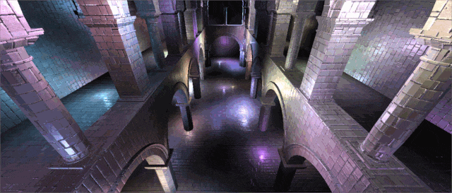
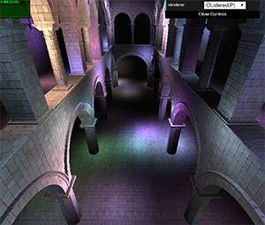
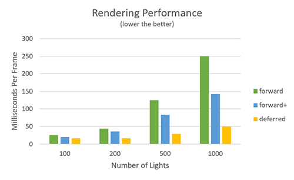

WebGL Clustered and Forward+ Shading
======================

**University of Pennsylvania, CIS 565: GPU Programming and Architecture, Project 5**

* Zheyuan Xie
* Tested on: Windows 10 Pro, i7-7700HQ @ 2.80GHz, 16GB, GTX 1050 2GB (Dell XPS 15 9560)

### Live Demo

Use keyboard shortcut to switch between rendering mode:
 - <1> - Switch to *simple forward rendering*.
 - <2> - Switch to *clustered forward rendering*.
 - <3> - Switch to *clustered deferred rendering*.
 - <4> - Switch to *clustered deferred rendering with Blinn-Phong shading*.

### Video Demo

Link to video: [https://youtu.be/wNil31n5d4k](https://youtu.be/wNil31n5d4k)

### Introduction

#### Clustered Rendering
In clustered shading. Instead of performing light culling checks on 2D screen tiles, we use 3D cells (clusteres). The screen is divided into tiles and the frustum is sliced along the z-axis as well. In the rendering pass, each pixel is assigned into a cluster, only lights affecting the assigned cluster will be calculated. This significantly reduce the amount of computation when there are many lights.

#### Deferred Shading
Deferred shading is a screen-space shading technique. Positions, normals, and material properties are fisrt rendered into the geometry buffer (G-buffer). After this, a pixel shader computes the lighting at each pixel using the information of the geometry buffer. Its primary advantage over forward shading is the decoupling of scene geometry from lighting.

### Features

 - **Clustered Forward (Forward Plus) Renderer**: Populate `clusterTexture` to store number of lights and list of lights for each cluster.
 - **Clustered Deferred Renderer**: Store vertex color, position, and normal into g-buffer. Do clustered rendering with information from g-buffer.
 - Blinn-Phong Shading for clustered deferred renderer. (New Effect)
 - Pack value into `vec4` and use 2-component normals. (Optimization)

### Performance Analysis

 - Simple forward rendering has the worst performance.
 - Clustered forward rendering has more advantage as the number of lights increases.
 - Clustered deferred rendering is generally much more faster than the previous two methods at the cost of higher memory bandwitdh.

 Blinn-Phong shading and the use of 2-component normals has no significant performance impact in terms of time spent per frame. Since Blinn-Phong shading requires additional computation for specular component, the use of 2-componetn normals requires extra computation for encoding and decoding, these features will decrease the rendering performance. However, these extra computational overhead did not affects FPS to a noticible extent.

### Credits

* [Three.js](https://github.com/mrdoob/three.js) by [@mrdoob](https://github.com/mrdoob) and contributors
* [stats.js](https://github.com/mrdoob/stats.js) by [@mrdoob](https://github.com/mrdoob) and contributors
* [webgl-debug](https://github.com/KhronosGroup/WebGLDeveloperTools) by Khronos Group Inc.
* [glMatrix](https://github.com/toji/gl-matrix) by [@toji](https://github.com/toji) and contributors
* [minimal-gltf-loader](https://github.com/shrekshao/minimal-gltf-loader) by [@shrekshao](https://github.com/shrekshao)
